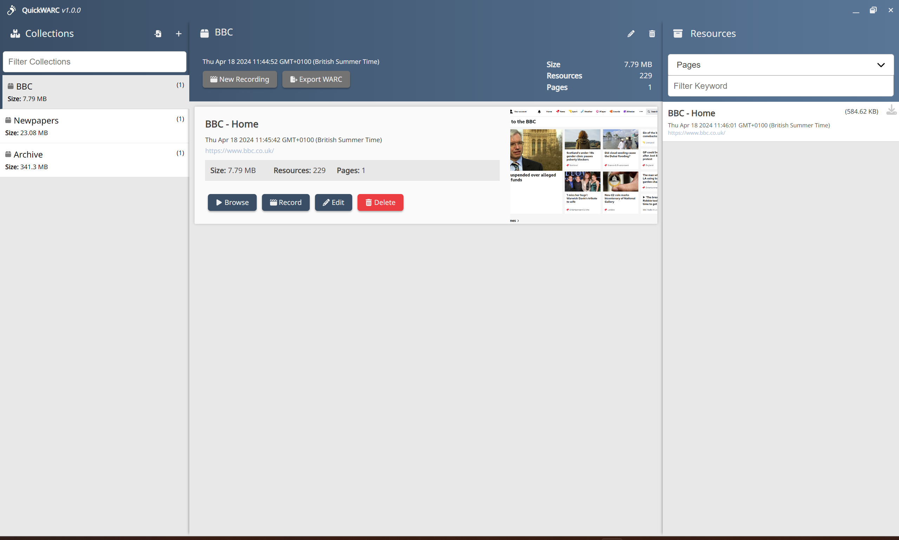

# QuickWARC

QuickWARC is an Electron-based application designed for creating, viewing, and managing WARC files easily. With QuickWARC, you can import existing WARC files for viewing, create new WARC files by assembling multiple captures into collections, and crawl websites to generate WARC files from the content.


## Features

- **Import WARC Files:** Easily view the contents of existing WARC files.
- **Create WARC Files:** Assemble multiple captures into single WARC files, creating collections of related content.
- **Website Crawling:** Initiate a crawl from a starting webpage, configuring it to capture as much or as little as you like, including content from external links.

### Crawling Options

- **Limit Site Depth:** Toggle to limit the crawl to a specified depth within the site.
- **Site Crawl Depth:** Defines how deep the crawl should go within the site.
- **External Crawl Depth:** Set the depth for crawling external links from the main domain.
- **Auto Scroll:** Automatically scroll pages to capture content loaded dynamically (e.g., infinite scroll pages and lazy-loaded images).
- **Scroll Delay:** Set the delay between scroll events, allowing time for content to load.
- **Request Delay:** The minimum time between page loads.
- **Page Timeout:** The maximum time to spend on a single page.
- **Ignore Fragment Identifiers:** Choose whether to include links with fragment identifiers in the crawl.
- **List of Exclusions:** Specify terms in URLs to be excluded from the crawl (e.g., excluding "/news" ignores links containing "/news" in the URL).

## Installation

To install QuickWARC, follow these steps:

```bash
git clone {repository-url}
cd {repository-directory}
npm install
npm run dist
```

After running these commands, you will find the setup executable in the dist folder.

## Contribution Guidelines

We welcome contributions from the community! If you'd like to contribute, please follow these steps:

1) Fork the Repository: Create your own fork of the repository.
2) Make Your Changes: Work on the changes you'd like to see and commit them to your fork.
3) Submit a Pull Request: Open a pull request from your fork back to the original repository with a clear description of the changes and why they are needed.
4) Code Review: Wait for a review from one of the project maintainers. There may be a discussion about the contribution.

## Licensing Information

QuickWARC is distributed under the Apache License 2.0, which allows for both personal and commercial use, modification, distribution, and distribution of modified versions of the software under the same license. For more details, see the LICENSE file in the repository.

## Support

For support, please direct any questions or issues to the GitHub issues page for this project. This will be the primary channel for support and discussions regarding bugs, feature requests, and contributions.

## Screenshots





